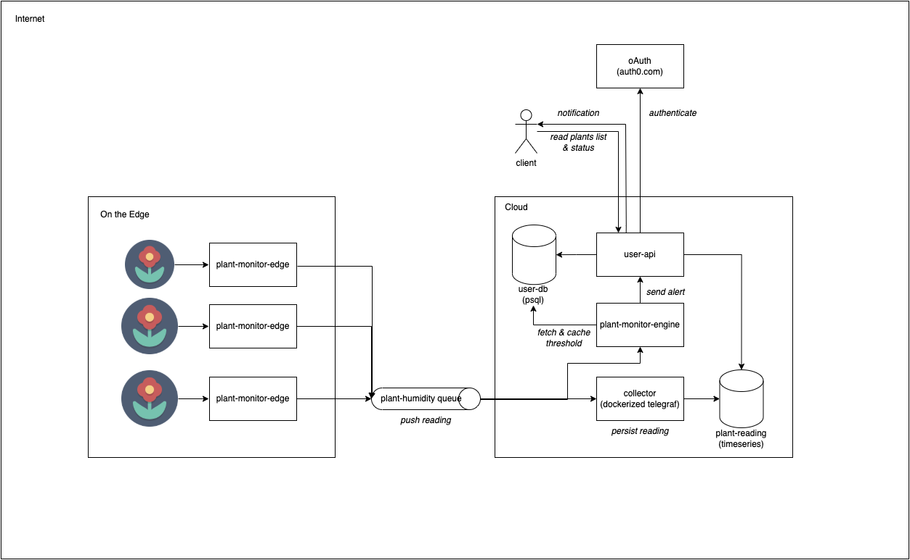

# Plant Monitor

## Problem

You work in industry selling plants and got an idea for a startup. The idea is to monitor plants humidity and allow owners to know when it should be watered.

Design a system that enable users to monitor humidity of number of plants and get notification when it is ready to water.

## API

### User API

- `[POST] /user` - register
- `[GET] /user/<id>` - get user profile
- `[PUT] /user/<id>` - update user profile
- `[POST] /user/<id>/plants` - add new plant
- `[GET] /user/<id>/plants&page=<pageNumber>` - get all plants, without page, default first 10 plants
- `[GET] /plants/<id>` - get plant by its ID

## Small Scale

### On the Edge

Plants are considered to be on the edge. The sensor is a data source, outside of the cloud. It is located and managed by the user. We have to account for malicous behaviour as well as protect against missuse.

The sensor provided by 3rd party will be integrated with a thin layer of a client developed inhouose that will communicate with cloud:

- sending a mesage to plant-connector (an API authenticated via API key) that will push a message to a plant-humidity-queue

## Mid Scale

### User API

- `[POST] /user` - register
- `[GET] /user/<id>` - get user profile
- `[PUT] /user/<id>` - update user profile

### Plant API

- `[POST] /user/<id>/plants` - add new plant
- `[GET] /user/<id>/plants&page=<pageNumber>` - get all plants
- `[GET] /plants/<id>` - get plant by its ID
- `[GET] /plants/<id>/should-water`

